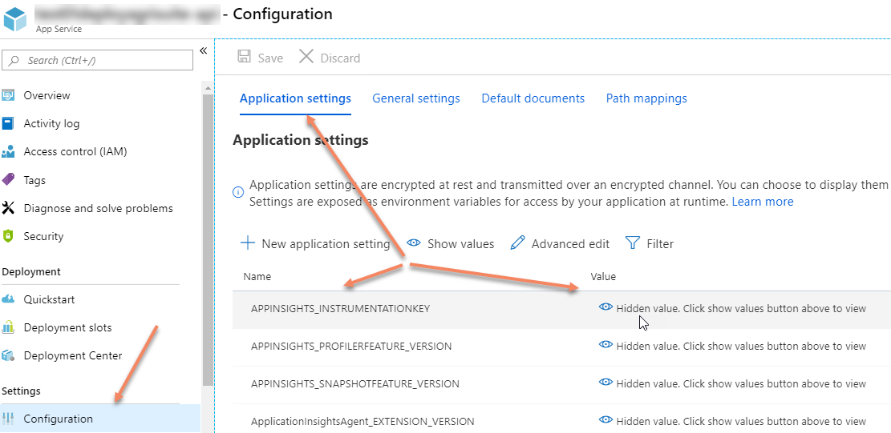
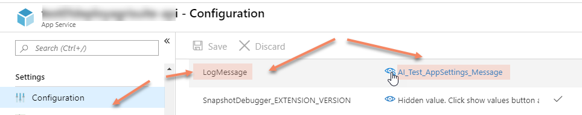
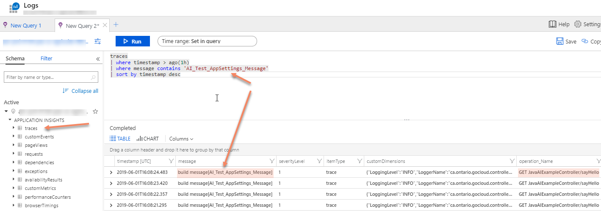
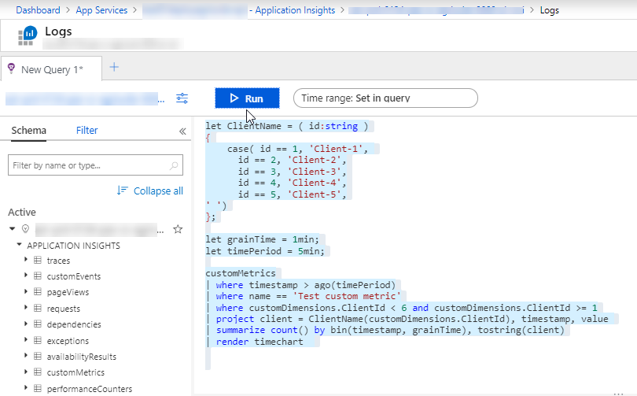
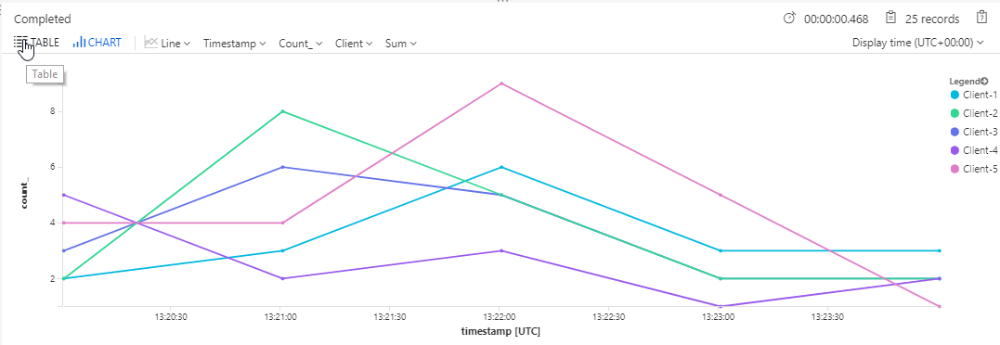

# Java Spring Boot Example integrating with Azure Application Insights
Azure Java Spring boot Example integrating with Application Insights

## Setup
Configure your target App Service in <code>pom.xml</code>

```xml
<resourceGroup>...</resourceGroup>
<appName>...</appName>
<subscriptionId>...</subscriptionId>
```
   

Set APPINSIGHTS_INSTRUMENTATIONKEY in your Azure App Service Application settings



Provide log message in your Azure App Service Application settings


Configure your Azure deployment credentials on maven <code>settings.xml</code>

```xml
	<server>
		<id>azure-auth</id>
		<configuration>
			<client>...</client>    
			<tenant>...</tenant>
			<key>...</key>
			<environment>AZURE</environment>
	  </configuration>
    </server> 
```

Configure proxy (fi required)
As you configure your Java project for ApplicationInsights to allow maven download dependencies you can set maven proxies in your settings.xml (e.g. in C:\Users\%myusername%\.m2)

```xml
  <proxies>
	 <proxy>
	  <id>mgsproxy</id>
	  <active>true</active>
	  <protocol>http</protocol>
	  <host>xx.xx.xx.xx</host>
	  <port>nnnn</port>
	</proxy>
  </proxies>
```


Deploy your application and Monitor your log messages and metrics in Azure Application Insights








